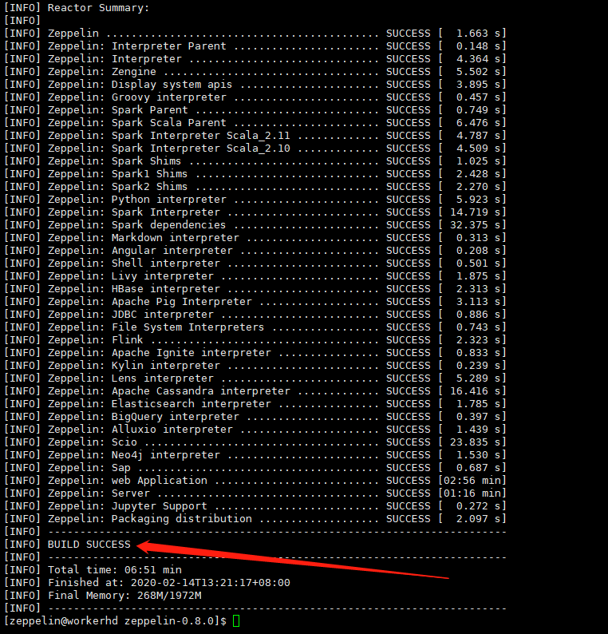
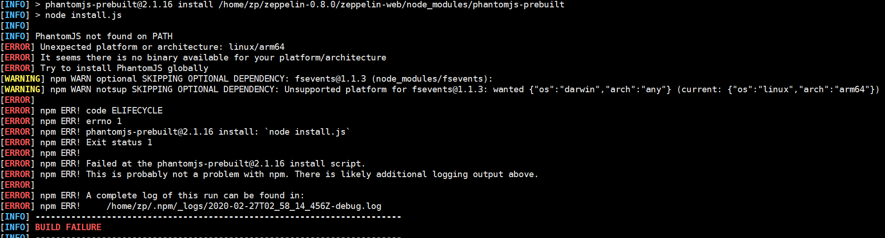

## 环境准备

apache产品下载地址：

http://archive.apache.org/dist/

### 安装jdk：

手动下载jdk 到对应目录下或者wget jkd对应版本的下载地址
解压  :

```linux
tar -zxvf  jdk-8u151-linux-x64.tar.gz
```

配置环境变量

```linux
vim /etc/profile
###添加如下信息：
export JAVA_HOME=/usr/local/java/jdk1.8.0_151
export PATH=$JAVA_HOME/bin:$PATH
export CLASSPATH=.:$JAVA_HOME/lib/dt.jar$JAVA_HOME/lib/tools.jar
```

```linux
##环境变量生效
source /etc/profile
```

### 安装maven 

下载 wget http://archive.apache.org/dist/maven/maven-3/3.3.9/binaries/apache-maven-3.3.9-bin.tar.gz
解压 修改环境变量 

```
vim /etc/profile
添加
export MAVEN_HOME=/usr/local/maven/apache-maven-3.3.9
export PATH=$MAVEN_HOME/bin:$PATH
##环境变量生效
source /etc/profile
##配置国内阿里云的仓库：
	<mirror>
      <id>alimaven</id>
      <name>aliyun maven</name>
      <url>http://maven.aliyun.com/nexus/content/groups/public/</url>
      <mirrorOf>central</mirrorOf>
    </mirror>
    
配置本地仓库：
    <localRepository>F:\MyRepository_maven</localRepository>
```

### 安装git

yum install git 一路确认即可 

### 安装node 

```
wget https://nodejs.org/dist/v8.9.3/node-v8.9.3.tar.xz
tar -zxvf node-v8.9.2.tar.xz  
##解压目录为
/usr/local/node/node-v8.9.3-linux-x64 
##建立软连接（类似快捷方式）
 ln -s /usr/local/node/node-v8.9.3-linux-x64/bin/npm  /usr/local/bin/
 ln -s /usr/local/node/node-v8.9.3-linux-x64/bin/node /usr/local/bin/
##软连接，类似快捷方式和win的环境变量,linux的全局命令在/usr/local/bin下
##修改全局目录配置文件
 vi /etc/profile
##添加：
 export PATH=$PATH:/usr/local/node/node-v8.9.3-linux-x64/bin
```

### 安装bower 

```
npm install -g bower
##注意：在root执行bower需要添加allow-root的指令 在普通用户下则不需要执行 因此编译zeppelin需要在普通用户下编译
```

## zeppelin编译安装

下载  wget http://archive.apache.org/dist/zeppelin/zeppelin-0.8.0/zeppelin-0.8.0.tgz

```
##添加普通用户
useradd zeppelin
飞腾：
adduser zeppelin //按照提示进行即可
su zeppelin
切换到普通用户时root安装的软件 普通用户无法使用  修改普通用户家目录下的.bashrc文件
cd /home/zeppelin解压zeppelin0.8.0版本
```

```
##首先在zeppelin-web编译看看能不能成功
跳过checkstyle   加上-Dcheckstyle.skip=true
mvn clean package -DskipTests -Dcheckstyle.skip=true
##成功后 cd .. 进行项目编译。
##在编译过程中会下载很多东西  耐心等待  

```



## 遇到的问题：

### 1 phantomjs无法下载 

```
##手动下载放到相应目录 /tmp/phantomjs/   或者
$ cd ~
$ vim .npmrc
##添加内容
sass_binary_site = https://npm.taobao.org/mirrors/node-sass/
phantomjs_cdnurl = https://npm.taobao.org/mirrors/phantomjs/
```

git config --global url."https://".insteadOf git:*//*

mvn clean     清除目标目录中的生成结果分

### 2 飞腾找不到 phantomjs对应的arrch64版本的问题



去github上找网友编译好的版本，（phantomjs_2.1.1_arm64.tgz）解压到目录，并设置软连接到/usr/local/bin 或者/usr/bin 和设置环境变量 添加path。

